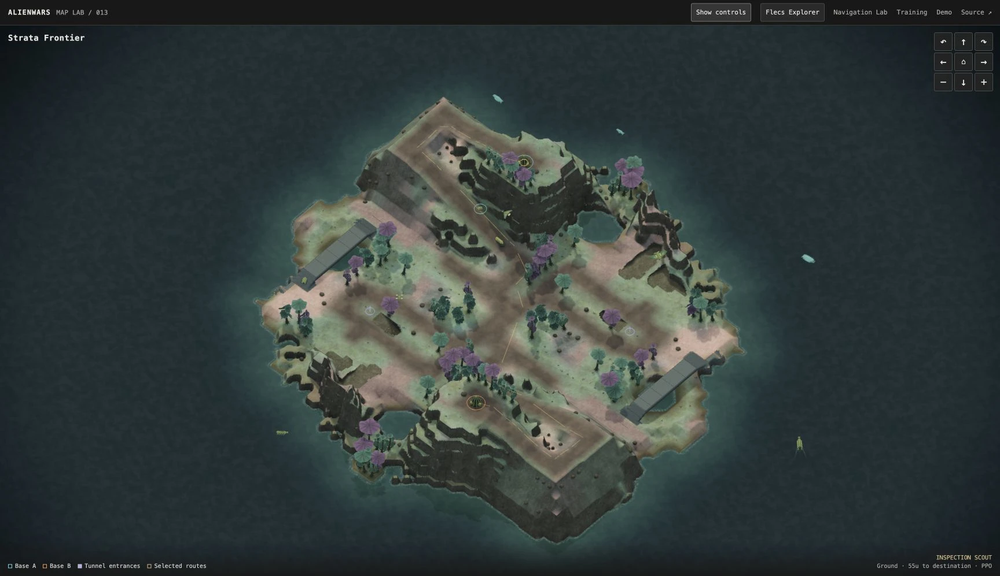
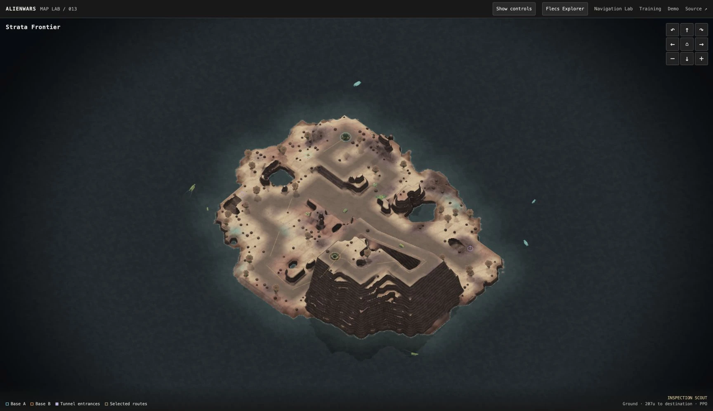
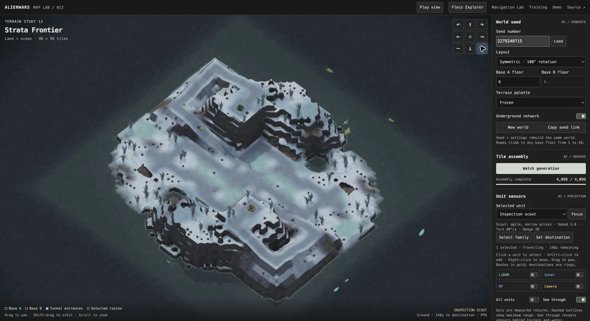
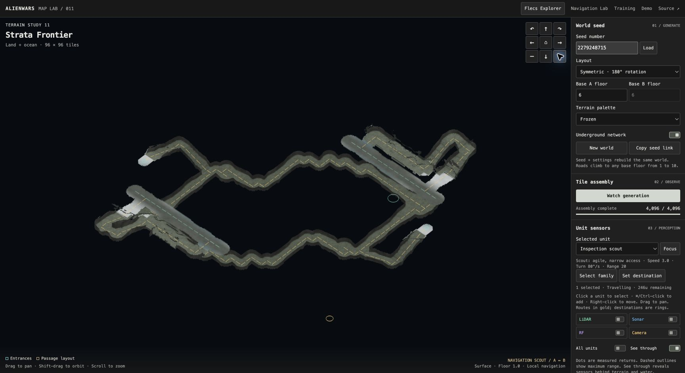
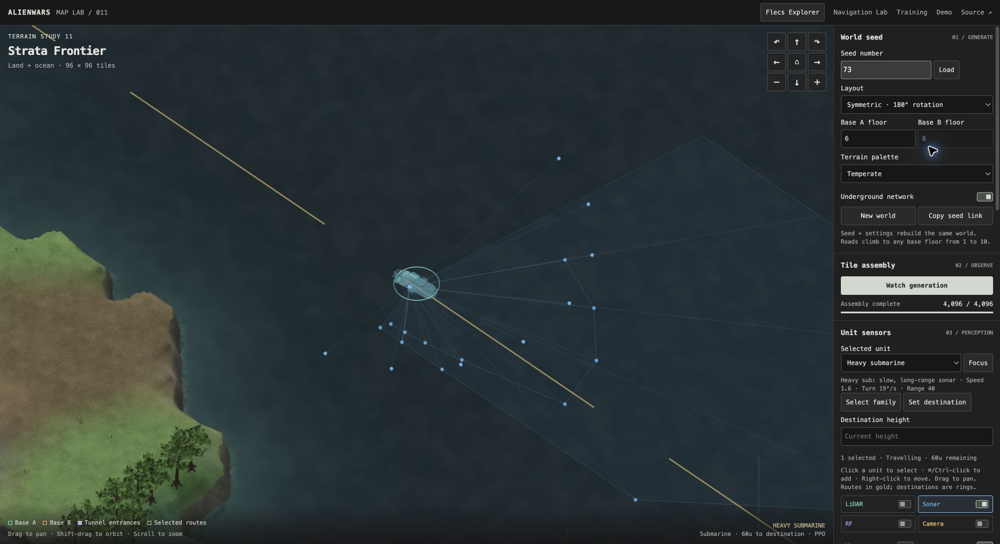
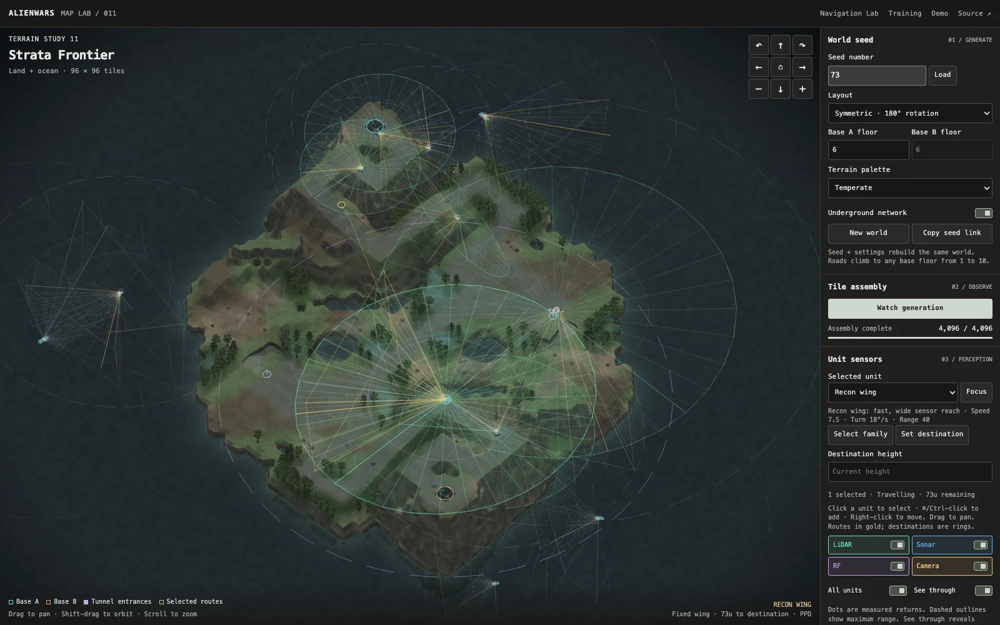

# AlienWars Gym

A gym for training AlienWars agents in procedural 3D worlds. **PufferLib 5** trains
native PPO controllers; **Raylib** renders the world; **WebAssembly** runs the
simulation, sensing and policy inference in your browser.

**[Explore Map Lab](https://rozgo.github.io/alienwars-gym/?seed=73)** ·
[Watch the showcase](https://rozgo.github.io/alienwars-gym/demo/) ·
[Fleet training results](https://rozgo.github.io/alienwars-gym/training/fleet.html) ·
[Training Observatory](https://rozgo.github.io/alienwars-gym/training/)

[](https://rozgo.github.io/alienwars-gym/maplab/?seed=73&biome=1)

## Worlds worth exploring

**Wave Function Collapse** connects terrain tiles, road grades and tunnel
profiles. Seeded landforms, rolling hills, beaches, ocean cliffs and lakes create
varied terrain; bridges and mountain passages fit the generated landscape.
Choose symmetric or asymmetric layouts, bases up to ten floors high, and one
coherent terrain palette: **Temperate, Desert or Frozen**.

| Asymmetric desert | Frozen frontier |
| --- | --- |
| [](https://rozgo.github.io/alienwars-gym/maplab/?seed=175847449&sym=0&a=2&b=9&biome=2&sensors=0) | [](https://rozgo.github.io/alienwars-gym/maplab/?seed=2279248715&sym=1&a=6&b=6&biome=3&sensors=0) |

## Twelve vehicles. Five learning families. One shared world.

Three ground vehicles, three boats, three aircraft and three submarines have
different hulls, speeds, turning limits and sensor reach. Fixed wings maintain
forward airspeed; the quadcopter can hover and strafe. Boats respect draft;
submarines navigate below the surface.

**A\* plans global routes. PPO controls local navigation.** Five family policies
train simultaneously in shared worlds, with individual destinations and recurrent
memory for each vehicle. The browser loads the selected trained checkpoints.
Select a unit or family and issue destinations, then follow their progress.

| See beneath the landscape | Navigate beneath the ocean |
| --- | --- |
| [](https://rozgo.github.io/alienwars-gym/maplab/?seed=2279248715&biome=3&isolate=1&sensors=0) | [](https://rozgo.github.io/alienwars-gym/maplab/?seed=73&biome=1&unit=11&sensors=2) |

The [recorded evaluation](docs/runs/shared-navigation-2026-09-16.md) covers three
training seeds and 49.5 million steps. Local navigation remains experimental;
combat and tactical coordination are future work.

## See what the agents sense

Attach **LiDAR, sonar, RF and depth cameras** to units, with ideal local odometry
for motion. Toggle sensor overlays for one unit or the whole fleet, inspect
returns through terrain and water, and view the live depth image. Equipment
changes policy inputs; overlay visibility only changes the display.

[](https://rozgo.github.io/alienwars-gym/maplab/?seed=73&biome=1&sensors=15&sensorsAll=1&unit=7)

Generation, collision, navigation and sensing share a renderer-independent C
model. Sensor sampling uses fixed buffers and runs without graphics during
training. The depth camera measures geometric depth; trees and rocks are
currently decorative rather than sensor occluders.

## Try it

Open **[Map Lab](https://rozgo.github.io/alienwars-gym/?seed=73)** — no installation.

- Drag to pan; Shift-drag to orbit; scroll to zoom.
- Click a vehicle; Command/Ctrl-click to add units; right-click a destination.
- Toggle sensor layers, select **All units**, or **Follow selected unit**.
- **Isolate tunnels** reveals underground routes without moving the camera.
- Choose a terrain palette and **New world** to explore another seed.

## Run locally

Run from the repository root. On macOS, use the Xcode command-line tools and
Homebrew `libomp`. Raylib 5.5 downloads on first use.

```sh
./scripts/check.sh
./build/maplab --seed=73 --biome=1
```

The smoke check builds Map Lab and the upstream Minimal interface example with
ASan/UBSan, generates a headless world and runs Minimal for 1,024 steps.

For the browser build, install the isolated Emscripten SDK in the
[web guide](docs/WEB.md), then:

```sh
python3 scripts/build_fleet_site.py  # five verified PPO checkpoints
python3 scripts/check_maplab.py
python3 scripts/check_shared.py
python3 -m http.server 8781 --bind 127.0.0.1 --directory docs
```

Open <http://127.0.0.1:8781/>. Training runs on an NVIDIA CUDA machine:

```sh
./build.sh alienwars_shared build/puffer-shared
python3 scripts/train_shared.py --prefix UNIQUE_RUN_NAME
```

See the [shared-world training contract](docs/SHARED_NAVIGATION.md) and
[GPU workflow](docs/DEVELOPMENT.md) for setup, curricula and reproducibility.
The project uses PufferLib's native C/CUDA API. Browser simulation and inference
run locally in WebAssembly.

## Go deeper

- [Map generation and validation](docs/MAPLAB.md) · [Generation research](docs/GENERATION_RESEARCH.md)
- [Sensor contract and benchmarks](docs/SENSORS.md)
- [Shared-world PPO, vehicle profiles and missions](docs/SHARED_NAVIGATION.md)
- [Historical trained-scout Navigation Lab](https://rozgo.github.io/alienwars-gym/navigation/?kind=1) · [Its training contract](docs/NAVIGATION_RL.md)
- [Raylib web builds and GitHub Pages](docs/WEB.md)
- [Showcase recording and screenshots](scripts/demo/README.md)
- [Agent instructions](AGENTS.md) · [Upstream provenance](docs/UPSTREAM.md)
- [PufferLib](https://github.com/PufferAI/PufferLib) · [Raylib](https://github.com/raysan5/raylib)

Based on [PufferAI/PufferLib](https://github.com/PufferAI/PufferLib), retained
under its [MIT license](LICENSE). Third-party asset notices remain with their
source files.
