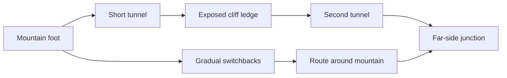

# Terrain and traversal generation: proposed next direction

Research date: September 14, 2026. This proposal was written against generator
version 6. Version 7 implements the first bounded mountain milestone: regional
route WFC, eight passage profiles, graded interior/bypass routes and sampled
walkable floor spans. The remaining ideas below are a roadmap, not implemented
features. See [the current world contract](MAPLAB.md#mountain-traversal--version-7).

The recommendation is to combine **hierarchical WFC with connectivity
constraints, terrain-aware route search, and continuous volumetric terrain**.
Use coherent noise and drainage rules to give the landscape natural structure.
Invest first in mountains and routes that move between their interior and
exterior, with useful alternative approaches. No new solver diagnostics UI is
part of the proposal.

## What the version 6 implementation made difficult

- `layout.h::aw_layout` generates the base roads before evaluating the landform
  field. Road shoulders then shape the terrain. The road search uses a small
  cardinal lattice; connector roads are flat. This biases the result toward
  terrain accommodating a route rather than a route negotiating a mountain.
- `map.h::aw_shape_domains` gives each shared vertex a low/high elevation choice
  around an existing target. The 16 cell patterns mainly enforce agreement on
  those choices. They cannot express a mountain pass, a cliff gallery, or a
  relationship between an upper path and an underground crossing.
- `caves.h::aw_cave_route` searches underground separately. Each search's vertical
  range lies between its endpoint elevations; a route cannot dip below both or
  climb above both without another waypoint. Its four passage profiles change
  width and height, rather than selecting passage topology.
- Navigation combines surface cells and passage centerlines, joined at declared
  portals. Large chambers, additional breaches, and paths overlapping vertically
  need richer walkable-area connectivity to become usable by units.
- `volume.h` already extracts a continuous solid using marching tetrahedra.
  `caves.h::aw_density` samples the same tetrahedra for collision. This agreement
  is valuable and should survive any generator or mesher change.

## Give WFC meaningful decisions at two scales

At the regional scale, solve for arrangements of ridges, passes, basins,
traversable slopes, and route connections. Inputs should be requirements and
areas of possibility: base districts, ocean boundary, candidate mountain
regions, required approaches, and a range of possible loops. Avoid prescribing
every path and then asking WFC only to decorate it.

Use explicit connectivity constraints for required destinations. Require
independent alternative paths between selected junctions, while permitting
intentional local chokepoints elsewhere. Applying a no-chokepoints rule to the
entire world would remove useful tactical structure. The DeBroglie WFC library
demonstrates both connected-path and independent-path constraints, including
matching directional exits. These constraints require more search and often
backtracking; they are not properties of ordinary adjacency rules alone.
[DeBroglie path constraints](https://boristhebrave.github.io/DeBroglie/articles/path_constraints.html)

Small graph rewrite rules can establish design relationships such as "split an
approach into a short enclosed route and a longer exposed bypass." WFC then
chooses compatible spatial realizations of these relationships. Counts,
locations, orientation, elevation, and subsequent branch expansions should vary
by seed. The rule is a reusable relationship, not a stored map footprint.

Paul Merrell's 2023 graph-grammar work is a useful longer-term direction for
learning compositional rules from example structures without a fixed grid. We
can start with authored traversal rules; importing that entire example-learning
system is not necessary for the first milestone.
[Merrell's paper, examples, and code](https://paulmerrell.org/grammar/)

At the local scale, WFC should select parameterized geometric modules spanning
several current cells where necessary. Initial module families should include:

| Terrain or route family | Choices with visible and traversal consequences |
| --- | --- |
| Mountain | Ridge continuation, branching ridge, saddle, steep flank, scree foot |
| Surface route | Contour ledge, switchback, shallow cutting, deep open cutting |
| Passage | Portal ramp, curved passage, widening chamber, junction, open gallery |
| Vertical interaction | Covered crossing, upper ledge above a passage, roof opening |
| Shore and basin | Beach, coastal cliff, lake margin, drainage valley |

Sockets must encode complete boundary geometry and actual passage exits:
elevation profile, heading, grade, width, headroom, solid support, and material
transition class. Upper and lower exits must remain distinct. Compatible visual
edges alone do not establish that a unit fits through the join.

Keep boundary samples shared and deterministic. Inside a module, procedural
geometry can curve and vary, while compatible boundary bands remain identical.
WFC selects a family and compatible parameters; it need not select every mesh
vertex. This preserves continuous terrain while allowing a much richer catalog.

## One route can go around, into, and out of a mountain

First generate a coarse terrain scaffold, then fit the proposed route graph to
it. Use a stateful search carrying position, elevation, heading, grade, and
construction mode. Candidate modes are surface following, an open cut, and a
tunnel. Add bridges later when supports and unit clearance are implemented.

Rank candidates using length, turning curvature, climbing, required excavation,
available rock cover, water constraints, and overlap with other approaches.
Hard limits reject excessive grades, insufficient body clearance, unsupported
floors, and unintended breaches into water. A charge for entering a tunnel and
minimum segment lengths discourage rapid surface/tunnel flickering.

Galin and colleagues directly address terrain-aware road generation, including
slope and obstacle costs, tunnels, bridges, and smooth road trajectories. Their
work is the strongest match for this part of our requirement.
[Procedural Generation of Roads, 2010](https://perso.liris.cnrs.fr/egalin/Articles/2010-roads.pdf)

Our proposed extension is to select several meaningfully different routes for
the gameplay graph instead of accepting only the cheapest connection. Route
roles can favor a wide gradual bypass, a shorter narrow passage, or an exposed
high approach. A shortest-path cost alone will not deliberately create that
variety. Avoid negative search costs for rewards; enforce route roles through
constraints and compare completed candidates.

A representative result to target:

The mountain and route layout remain procedural. This relationship should be
one possible composition among others, not a mandatory motif in every seed.
Retain the opposite-diagonal underground network while allowing additional
mountain portals away from its two primary entrances.

Refine routes using curve primitives with bounded curvature and grade. Validate
the full swept road or unit footprint after refinement; smoothing a valid
centerline can otherwise cut through a wall or leave a ledge. Let local WFC
choose compatible bends, transitions, and junctions in a corridor around the
proposed route. If geometry cannot realize it, retry that region or candidate
route with its boundary requirements preserved.

## Natural landforms: noise, drainage, and restrained erosion

Perlin noise is useful, but changing the noise function alone will not produce
the structural relationships we want. I recommend a ridge/valley scaffold with
domain-warped fractal noise for irregularity. FastNoise Lite provides C support,
OpenSimplex2/OpenSimplex2S, ridged fractals, cellular noise, and domain warping.
It is a candidate library, not an adopted dependency or a measured performance
improvement. Quantize authoritative results and verify native/WASM seed parity
before adopting its floating-point output.
[FastNoise Lite](https://github.com/Auburn/FastNoiseLite)

Use drainage relationships to organize valleys, wet ground, lakes, and eventual
rivers. Hydrology-inspired terrain construction can produce coherent terrain
without running a full physical erosion simulation. Start with coarse drainage
and limited slope relaxation, reserving costly hydraulic erosion for later
experiments or offline generation.
[Terrain Generation Using Procedural Models Based on Hydrology, 2013](https://perso.liris.cnrs.fr/eric.galin/Articles/2013-river-networks.pdf)

Apply large terrain changes before fitting roads. Protect road support, passage
clearance, and compatible boundary profiles during final detail shaping. Use
world-space noise with symmetry-aware evaluation; independently seeding each
tile would break continuity. Below the geometry sampling scale, keep detail in
materials and normal shading rather than creating unresolvable obstacles.

Biomes should follow those same fields: exposed rock on steep slopes, sediment
at their feet, wet ground near drainage, and coherent altitude/climate regions
for snow. Material WFC resolves permissible regional transitions. It should
not overwhelmingly favor an unrelated material-noise sample at every cell.

## Marching cubes is a separate decision

WFC determines compatible structure. An implicit scalar field represents solid
and empty space. An isosurface mesher turns that field into triangles. These
three jobs work together.

Keep marching tetrahedra for the initial generation change. It already handles
the required excavations, and matching collision interpolation is implemented.
Expand the field beyond a height surface minus arch sweeps where the new modules
need overhangs or more complex rock forms. Update the mesher's vertical bounds
and collision queries together when adding such forms. Our current field is
not a true signed-distance function; distance-based methods cannot assume it is.

Evaluate a robust marching-cubes implementation later if triangle count or
directional artifacts become a demonstrated bottleneck. Ambiguous cube cases
require deliberate treatment; a mesher swap must also update collision to agree
with the extracted surface. Marching cubes does not itself generate passes,
tunnels, or interesting route choices.
[Lewiner's marching-cubes work](https://thomas.lewiner.org/pub/marching_cubes_jgt.html)

Dual contouring is another option for preserving sharp geometric features.
The original Hermite-data method uses intersection and normal information;
SIGGRAPH 2026 work reconstructs sharp features from sampled signed-distance data
without supplied gradients. The latter would require a suitable distance field
and a separate browser/runtime evaluation here. Neither is a prerequisite for
the next generation milestone.
[Dual Contouring of Hermite Data](https://www.cs.rice.edu/~jwarren/papers/dualcontour.pdf),
[Dual Contouring of Signed Distance Data, 2026](https://gatc.cs.columbia.edu/projects/dual-contouring-of-signed-distance-data.html)

## First implementation milestone

Build a procedural mountain region integrated into the existing world, with a
route that can alternate between surface, cutting, tunnel, and cliff ledge, plus
a distinct traversable bypass. Introduce the richer WFC module/socket model in
that region and use connectivity constraints for its approaches. Keep regional
solves and route searches bounded so browser generation stays practical.

Make its traversal real: derive walkable spans and connections from the composed
solid, accounting for body radius, headroom, slope, and support. Large chambers
need traversable area; a centerline through them is insufficient. Different unit
classes should eventually get different access, allowing a wide vehicle route
and a smaller-unit shortcut to have different strategic value. The initial
milestone can validate explicit small/large footprint profiles with scripted
traversal; that does not constitute trained AlienWars behavior or combat.

Acceptance should demonstrate continuous joins, usable portal ramps, passages
that remain underground where intended, and alternative routes that differ in
length, grade, width, and exposure. Check a range of seeds and both symmetry
modes, preserving the ocean, enclosed lakes, requested base heights, and the
opposite-diagonal passage requirement. Symmetric mode must mirror structure and
detail; asymmetric mode should vary independently. Promote successful patterns
into additional regions without freezing one mountain footprint or road loop.

This milestone tests the proposed combination in a visible, playable piece of
the world before expanding every subsystem. The research supports the component
techniques; visual quality, browser cost, and actual gameplay difficulty still
need to be established by implementation and playtesting.
