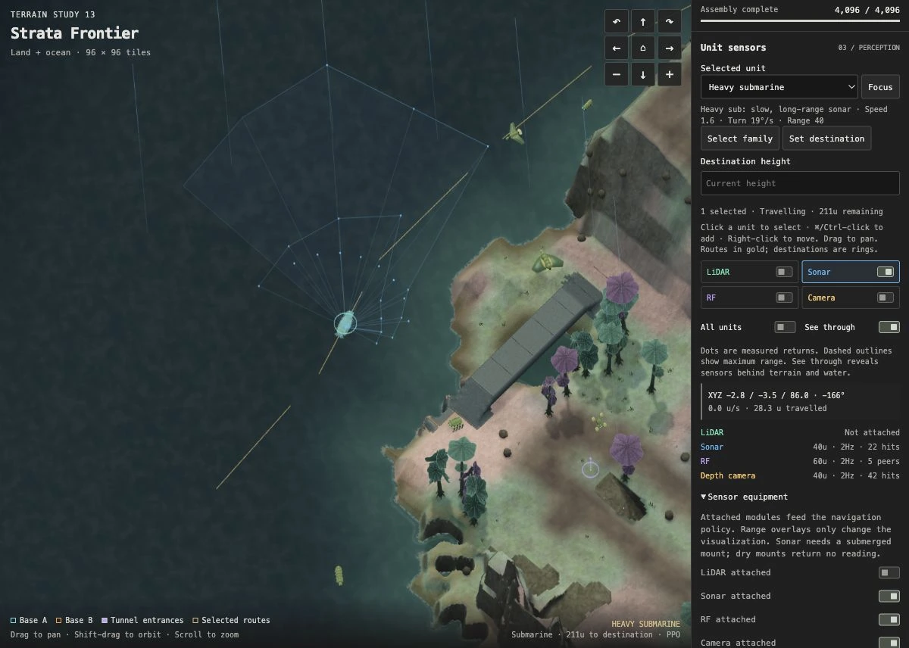
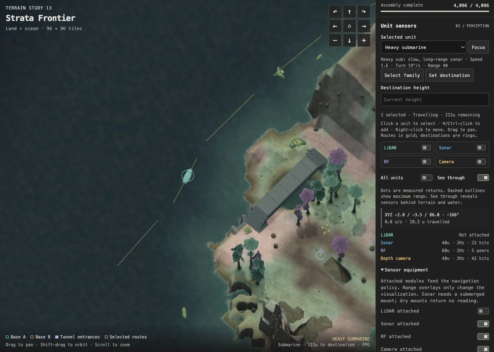
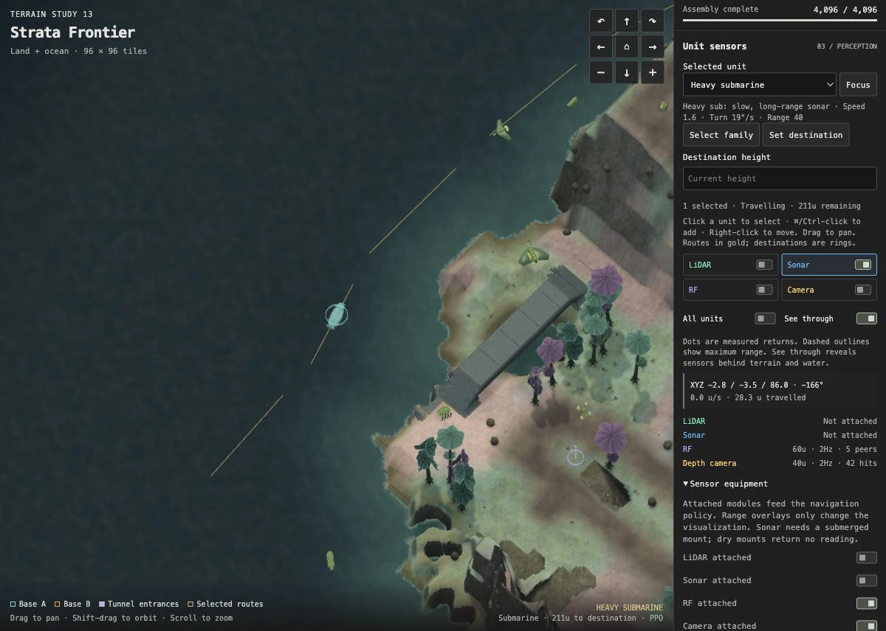

# Sensor equipment and overlays

**About five minutes · browser only.** In this exercise you will compare two
sonar controls and use the readout to check which one affects the unit’s
measurements. A policy is the trained controller that uses those measurements
to help choose movement.

## Before you start

If you hide the sonar overlay, does the submarine lose its sonar readings?
What if you detach the sonar module instead? Make a prediction before trying it.

## Procedure

1. Open [the heavy submarine in Map Lab](https://rozgo.github.io/alienwars-gym/maplab/?seed=73&sym=1&a=6&b=6&biome=1&tunnels=1&cut=1&unit=11&sensors=2).
   For a local copy, use that query after `http://127.0.0.1:8781/maplab/`.
   Wait for the world to load, then click **Focus** under Selected unit.
2. Find the **Sonar** reading under Unit sensors. Note its range, sampling rate
   and hit count. If the mount is temporarily invalid, let the unit move until
   there is a valid reading. Zero hits is valid; it is not “Not attached.”

   

   Here the range is 40 world units, the sensor samples twice per second, and
   22 rays hit something. Click any screenshot to see its controls at full size.

3. Turn **Show sonar ranges** off. The drawn fan disappears; the module remains
   attached and its reading is still available. Turn the overlay back on.

   

   The fan is gone, but the Sonar row still shows measurements.

4. Expand **Sensor equipment**, then turn **Sonar attached** off. The reading now
   says **Not attached** and sonar measurements are masked in the policy input.

   

   The overlay is enabled here, but there are no sonar measurements to draw.

5. Reattach sonar. On a valid submerged mount, readings resume at its scheduled
   sampling rate. Try the same distinction with RF or the depth camera.

Traffic was paused for the screenshots to keep the view fixed. In your live run,
the readings can change as the submarine and nearby units move.

| Change | Display | Policy input |
| --- | --- | --- |
| Hide sonar overlay | Fan disappears | Sonar still sampled |
| Detach sonar module | Fan disappears; “Not attached” | Missing-sensor flag; no sonar readings |
| Reattach sonar | Fan/returns resume when valid | Valid readings become available again |

The unit keeps moving during this exercise. Reading counts may change because
its pose and neighbors change. This is a measurement experiment, not a paired
navigation benchmark. A detached sensor does not guarantee an immediate visible
turn: other sensors and A* route guidance still provide information.

## What the results mean

The sensor samples the world and stores its readings. The overlay draws those
stored readings. Hiding the overlay leaves sampling active. Detaching the module
disables that source of measurements. The controller receives its usual input
layout, with a flag indicating that sonar is missing. Other sensors and route
guidance remain available.

The current depth camera is an **8 × 6 radial depth image**, not RGB. Sonar needs
a submerged mount above the seabed. Decorative flora do not currently occlude
these sensors. Equipment edits are not saved in seed URLs; reload to restore
defaults. Share the seed link together with your equipment settings.

## Follow one reading through the code

Ask your coding agent:

> Read AGENTS.md and docs/lessons/sensor-equipment.md. Trace the heavy submarine's
> sonar from attachment through sampling and observation packing to the PPO input.
> Explain why hiding its overlay does not disable sensing. Show the relevant
> functions and help me verify this in the local browser.

Useful starting points:

- [`sensors.h`](../../ocean/alienwars/sensors.h): `aw_sensor_attach`,
  `aw_sensor_sample`, `aw_sensor_pack`.
- [`missions.h`](../../ocean/alienwars/missions.h): mission observation assembly.
- [`alienwars.c`](../../ocean/alienwars/alienwars.c): `aw_sensor_control` bridges
  the inspector and simulation.
- [`shell.html`](../../web/maplab/shell.html): equipment and overlay handlers.
- [Sensor contract](../SENSORS.md): layout, sampling and validation.

## Optional exercise: increase sonar range

With a working source-build setup, ask your agent to increase only the heavy
submarine's sonar range by 25%, locating its effective configuration first.
Keep the observation layout fixed, rebuild, and verify the range readout changed.
Run `uv run scripts/check_sensors.py` and the shared checks if policy inputs change.
Review the diff and revert only your experimental edit when finished.

Changing range does not train the policy to exploit it. It changes its input
distribution; a claim of better navigation needs held-out evaluation, and may
need retraining. Keep experimental weights separate from published policies.
